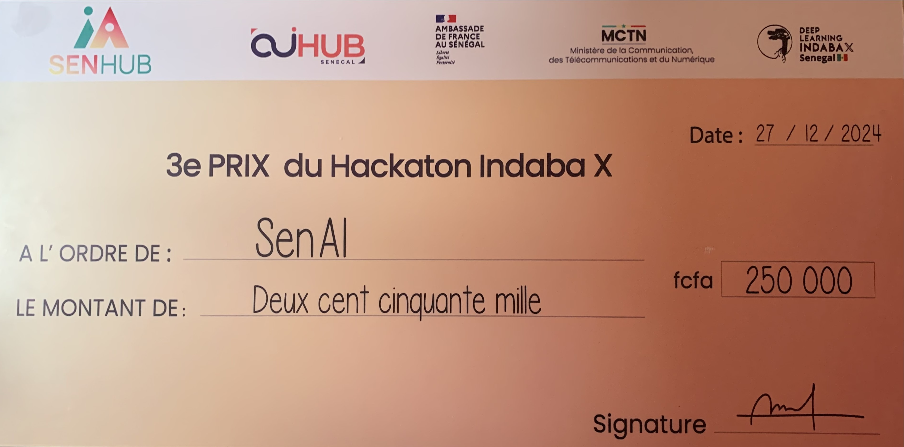

# ASR for Wolof

## Description

This competition focuses on building an Automatic Speech Recognition (ASR) model for Wolof, a low-resource language spoken in Senegal and West Africa. Due to limited available datasets and linguistic resources, creating an accurate ASR model for Wolof presents unique challenges.

**Goal**: The goal of this hackathon is to build effective ASR models that can overcome data scarcity and hardware constraints, advancing the field of speech recognition for low-resource languages like Wolof.

Participants should note that there are hardware limitations for this hackathon: GPU resources on Google Colab are limited to the T4 model, and training time is capped at 5 hours per session. These constraints encourage innovative approaches to optimise model performance within these boundaries, enhancing participants' skills in resource-efficient machine learning.

**Competition Link**: [Kaggle - ASR in Wolof](https://www.kaggle.com/competitions/asr-in-wolof/overview)

**Why ASR for Wolof?**

Wolof ASR technology has the potential to significantly improve accessibility for Wolof speakers in digital spaces, contributing to language preservation and enhancing inclusivity. This project aligns with the broader goals of expanding language resources in technology, empowering communities, and fostering language diversity.

With three other friends, we formed the SENAI team, participated in the competition and won 3rd prize.

**Authors**:
- Amadou Ngam
- Fallou Diagne
- Adama Traoré
- Moustapha Fall (myself)



**Resources**:
- Raw Dataset: [IndabaxSenegal/asr-wolof-dataset](https://huggingface.co/IndabaxSenegal/asr-wolof-dataset)
- Processed Dataset: [TaphaFall/asr-wolof-dataset-processed-v1](https://huggingface.co/TaphaFall/asr-wolof-dataset-processed-v1)
- Winning Model: [ngia/whisper-small-wolof](https://huggingface.co/ngia/whisper-small-wolof)

**Training Strategy**:
To address resource constraints, we iteratively trained the model with a limited number of epochs, saving the model state after each session. We utilised Kaggle's GPU resources, and each team member had a 24-hour quota, which we strategically managed to optimise the training process.

## Installation

1. Clone the repository:
   ```bash
   git clone https://github.com/your-repo-name.git
   cd asr-for-wolof
   ```

2. Download the datasets:
   - Raw Dataset: [IndabaxSenegal/asr-wolof-dataset](https://huggingface.co/IndabaxSenegal/asr-wolof-dataset)
   - Processed Dataset: [TaphaFall/asr-wolof-dataset-processed-v1](https://huggingface.co/TaphaFall/asr-wolof-dataset-processed-v1)

3. Train the model (example):
   ```bash
   python train.py --epochs 5 --batch_size 16 --dataset_path /path/to/dataset
   ```

## Perspectives

- Enhance dataset quality by collecting more annotated audio data.
- More training for the model
- Extend ASR support to additional dialects of Wolof and other low-resource languages.
- Deploy the ASR model as a user-friendly web or mobile application for broader accessibility.

## Contributing  🤝

We welcome contributions to this project! To contribute:

1. Fork the repository.
2. Create a new branch (`feature/your-feature-name`).
3. Commit your changes and push them to your forked repository.
4. Open a pull request, detailing the changes and their purpose.

## Référence

Djim Momar Lo. Automatic Speech Recognition in Wolof. https://kaggle.com/competitions/asr-in-wolof, 2024. Kaggle.

---
